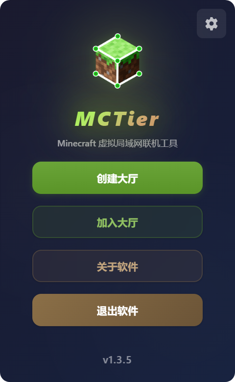
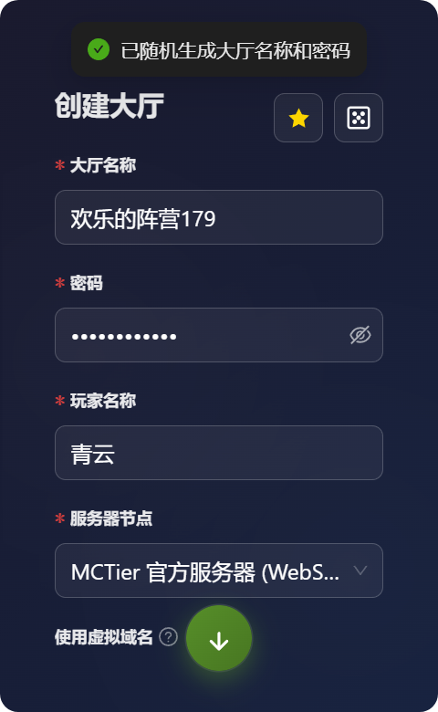
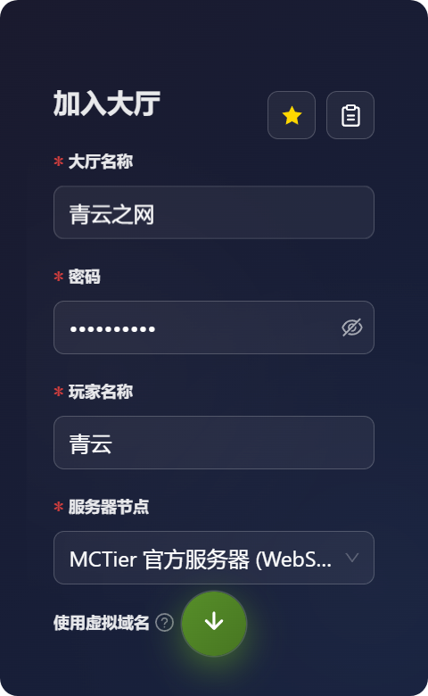
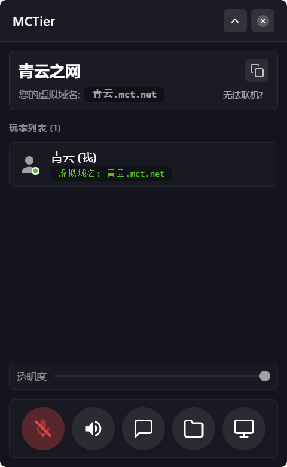
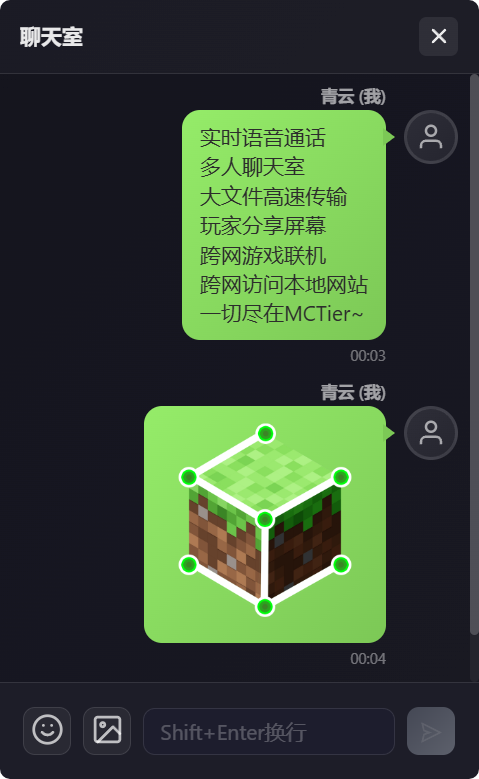
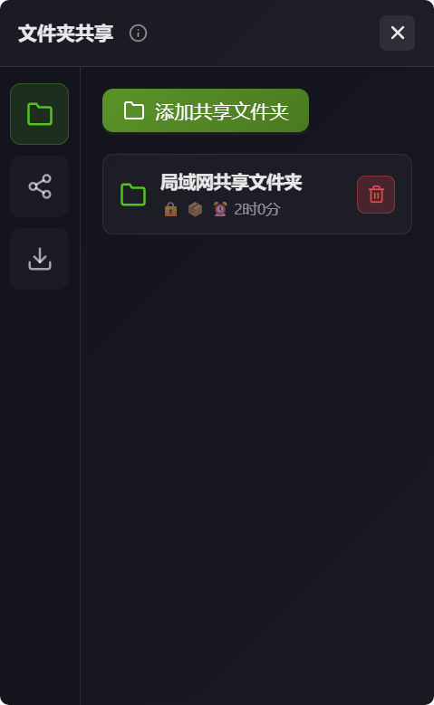
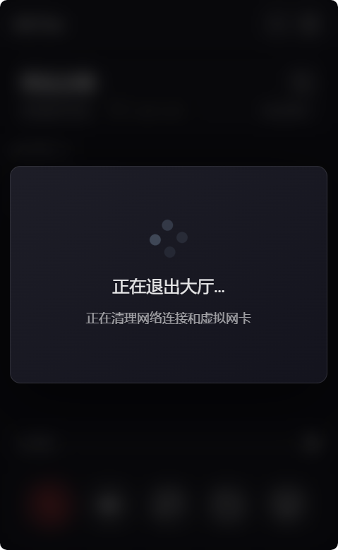
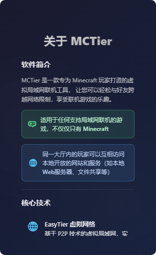

<div align="center">


# **MCTier**

### Minecraft 虚拟局域网联机工具

<p align="center">
  
  
  
</p>


<p align="center">
  <a href="https://github.com/pmh1314520/MCTier">GitHub</a> •
  <a href="https://gitee.com/peng-minghang/mctier">Gitee</a> •
  <a href="#-功能特性">功能特性</a> •
  <a href="#-快速开始">快速开始</a> •
  <a href="#-使用说明">使用说明</a>
</p>

---

### 让跨网络联机变得简单

MCTier 是一款专为 Minecraft 玩家打造的虚拟局域网联机工具，让您可以轻松与好友跨越网络限制，享受联机游戏的乐趣。

**🎮 不仅仅是 Minecraft** - 适用于任何支持局域网联机的游戏

**🌐 局域网互访** - 同一大厅内的玩家可以互相访问本地开放的网站和服务

</div>

---

## 📸 软件预览

<div align="center">

### 主界面



简洁优雅的主界面，提供创建大厅、加入大厅、关于软件等功能入口

---

### 创建大厅



输入大厅名称、密码和玩家名称，一键创建虚拟局域网大厅

---

### 加入大厅



输入大厅名称、密码和玩家名称，快速加入好友的大厅

---

### 常用大厅信息


将常用的大厅信息记录下来，之后快速选择一键填写

---

### 大厅界面



迷你悬浮窗设计，实时显示在线玩家、语音状态、虚拟IP等信息

---

### 聊天室界面



每个大厅内置独立聊天室，同大厅内的玩家可以在这里交流

---

### 文件夹共享界面



可以将自己电脑本地的任何文件夹共享给同大厅内的其他玩家高速下载

---

### 退出大厅



安全退出大厅，自动清理网络连接和语音通话

---

### 关于软件



查看软件信息、开源协议、技术栈和开发者信息

</div>

---

## ✨ 功能特性

### 核心功能

- **🌐 虚拟局域网** - 基于 EasyTier P2P 技术，实现跨网络的直连通信
- **🎙️ 实时语音** - 内置 WebRTC 语音通话，低延迟、高质量
- **💬 P2P聊天室** - 基于 HTTP over WireGuard 的点对点聊天，支持文本和图片消息
- **📁 文件共享** - HTTP over WireGuard 高速文件传输，支持批量下载、先压后发、密码保护
- **📺 屏幕共享** - 基于 WebRTC 的实时屏幕共享，可查看队友画面
- **⚡ 快捷键控制** - 全局快捷键控制麦克风（Ctrl+M）和全局听筒（Ctrl+T）
- **🎯 迷你悬浮窗** - 游戏时不遮挡视野，随时查看玩家状态，支持透明度调节
- **🔒 大厅隔离** - 每个大厅独立隔离，保护隐私安全
- **🌍 虚拟域名** - 支持 Magic DNS 功能，使用域名（如：玩家名.mct.net）代替IP地址
- **🛠️ 高级网络配置** - 支持子网代理、网段映射、虚拟域名等高级功能
- **📋 快速分享** - 一键复制大厅信息，自动识别剪贴板内容
- **🔔 音效提示** - 玩家加入/离开、新消息等事件音效提醒
- **🔄 自动配置** - 无需手动设置，自动完成网络配置
- **🎨 现代化UI** - 精美的界面设计，流畅的动画效果，支持窗口透明度调节

### 技术亮点

| 技术栈 | 说明 |
|--------|------|
| **Tauri 2.0** | 现代化桌面应用框架，轻量高效 |
| **React 19** | 最新的 React 版本，流畅的用户体验 |
| **EasyTier** | P2P 虚拟网络技术，实现跨网络直连 |
| **WebRTC** | 实时语音通信和屏幕共享技术 |
| **HTTP over WireGuard** | 基于虚拟网络的P2P聊天和文件共享 |
| **Rust** | 高性能后端，安全可靠 |
| **Magic DNS** | 基于 hosts 文件的虚拟域名系统 |

---

## 🚀 快速开始

### 系统要求

- **操作系统**: Windows 10/11 (64位)
- **内存**: 至少 2GB RAM
- **磁盘空间**: 至少 100MB
- **网络**: 稳定的互联网连接

### 下载安装

前往 [GitHub Releases](https://github.com/pmh1314520/MCTier/releases) 或 [Gitee Releases](https://gitee.com/peng-minghang/mctier/releases) 下载最新版本。

**安装程序版本**（推荐）
- 下载 `MCTier-Setup.exe`
- 双击运行安装程序
- 按照向导完成安装

**免安装版本**

- 下载 `MCTier-Portable.7z`
- 解压到任意目录
- 双击 `mctier.exe` 启动

---

## 📖 使用说明

### 创建大厅（开房的玩家）

1. 启动 MCTier，点击 **创建大厅**
2. 输入自定义大厅名称
3. 设置自定义大厅密码
4. 随便起个玩家名称
5. 点击 **创建** 按钮
6. 等待虚拟网络初始化完成
7. 将大厅的名称和密码分享给你的好友

### 加入大厅（入房的玩家）

1. 启动 MCTier，点击 **加入大厅**
2. 输入好友分享的大厅名称和密码
3. 随便起个玩家名称
4. 点击 **加入** 按钮
5. 等待连接到虚拟网络

### 开始游戏

成功加入大厅后，你会获得一个虚拟 IP 地址（如 `10.126.126.2`）

**如果启用了虚拟域名功能，你还会获得一个虚拟域名（如 `玩家名.mct.net`），可以使用域名代替IP地址进行连接**

**在 Minecraft 中：**

1. 房主打开单人世界，按 ESC 键
2. 点击 **对局域网开放**，记住端口号（如 25565）
3. 其他玩家在多人游戏中点击 **直接连接**
4. 输入房主的虚拟 IP 和端口（如 `10.126.126.1:25565`）
   - 或使用虚拟域名（如 `房主名.mct.net:25565`）
5. 点击加入服务器

**房主的虚拟 IP 通常是 `10.126.126.1`，虚拟域名是 `房主名.mct.net`**

**注意：房主一般都需要安装 mcwifipnp 模组以关闭正版验证！**

### 语音通话

- **开启/关闭麦克风**: 点击麦克风图标或按快捷键（默认 Ctrl+M）
- **静音玩家**: 点击玩家列表中的扬声器图标
- **开启/关闭全局听筒**: 点击扬声器图标或按快捷键（默认 Ctrl+T）

### P2P聊天室

MCTier 提供了基于 HTTP over WireGuard 的点对点聊天功能，无需中转服务器。

#### 使用聊天室

1. 在大厅界面底部点击 **聊天室** 按钮
2. 在输入框中输入文字消息，按回车发送
3. 点击表情按钮可以插入表情符号
4. 点击图片按钮可以发送图片（支持粘贴截图）
5. 聊天记录会自动保存，下次进入大厅时可以查看历史消息

**特点：**
- 完全 P2P 通信，不经过中转服务器
- 支持文本和图片消息
- 实时消息推送（基于 SSE）
- 自动消息去重，避免重复显示
- 未读消息提示和音效提醒

### 屏幕共享

MCTier 支持基于 WebRTC 的实时屏幕共享功能，可以查看队友的画面。

#### 开始屏幕共享

1. 在大厅界面底部点击 **屏幕共享** 按钮
2. 点击 **开始共享** 按钮
3. 选择要共享的屏幕或窗口
4. 其他玩家会收到通知，可以点击查看你的屏幕

#### 查看队友屏幕

1. 当有玩家开始屏幕共享时，会收到通知
2. 在屏幕共享界面点击该玩家的共享
3. 即可实时查看队友的屏幕画面

**注意事项：**
- 屏幕共享会占用一定的网络带宽
- 建议在网络状况良好时使用
- 可以随时停止共享

### 迷你窗口

进入大厅后，软件会自动切换到迷你悬浮窗模式：
- 可以拖动窗口到任意位置
- 点击展开/收起按钮控制窗口大小
- 游戏时不会遮挡视野

### 文件共享

MCTier 提供了强大的 HTTP over WireGuard 文件共享功能，让同大厅内的玩家可以高速传输文件。

#### 添加共享文件夹

1. 在大厅界面底部点击 **文件共享** 按钮
2. 点击 **添加共享文件夹** 按钮
3. 选择要共享的文件夹
4. 设置访问密码（可选，用于保护共享内容）
5. 设置有效期（可选，过期后自动移除共享）
6. 开启"先压后发"（可选，批量下载时自动打包成ZIP）
7. 点击 **确定** 完成添加

**注意事项：**
- 共享文件夹会实时同步，添加或删除文件后其他玩家会立即看到
- 支持同时共享多个文件夹
- "先压后发"功能可以提高批量下载效率，下载完成后自动解压

#### 浏览和下载文件

1. 在文件共享界面，点击其他玩家共享的文件夹
2. 如果设置了密码，需要输入正确的密码才能访问
3. 浏览文件夹内容，可以单个下载或批量下载
4. 批量下载时，如果共享者开启了"先压后发"，会自动打包下载并解压
5. 在 **传输列表** 中查看下载进度和已完成的文件

**传输特点：**
- 基于 HTTP over WireGuard，完全 P2P 直连
- 支持断点续传和多文件并发下载
- 批量下载支持"先压后发"，自动打包和解压
- 下载完成后可以直接打开文件所在文件夹

#### 管理共享

- **删除共享**：在 **我的共享** 列表中点击删除按钮
- **查看传输**：切换到 **传输列表** 查看正在下载和已完成的文件
- **取消下载**：在传输列表中点击取消按钮停止下载

---

## 🛠️ 开发指南

### 环境要求

- **Node.js**: 18.0+
- **Rust**: 1.70+
- **npm**: 9.0+

### 安装依赖

```bash
# 克隆仓库
git clone https://github.com/pmh1314520/MCTier.git
cd MCTier/mctier

# 安装依赖
npm install
```

### 开发模式

```bash
npm run tauri dev
```

### 构建项目

```bash
npm run tauri build
```

构建完成后，文件位于 `src-tauri/target/x86_64-pc-windows-msvc/release/bundle/`

### 项目结构

```
mctier/
├── src/                          # 前端源代码
│   ├── components/              # React 组件
│   │   ├── MainWindow/         # 主窗口
│   │   ├── MiniWindow/         # 迷你窗口
│   │   ├── LobbyForm/          # 大厅表单
│   │   ├── PlayerList/         # 玩家列表
│   │   ├── VoiceControls/      # 语音控制
│   │   ├── ChatRoom/           # P2P聊天室
│   │   ├── FileShareManager/   # 文件共享管理
│   │   ├── ScreenShareManager/ # 屏幕共享管理
│   │   ├── NetworkDiagnostic/  # 网络诊断
│   │   ├── MinecraftHelper/    # Minecraft 助手
│   │   └── AboutWindow/        # 关于窗口
│   ├── services/                # 服务层
│   │   ├── webrtc/             # WebRTC 客户端（语音、屏幕共享）
│   │   ├── chat/               # P2P聊天服务
│   │   ├── fileShare/          # 文件共享服务
│   │   └── hotkey/             # 快捷键管理
│   ├── stores/                  # 状态管理
│   └── types/                   # TypeScript 类型
├── src-tauri/                   # Tauri 后端
│   └── src/
│       └── modules/            # 功能模块
│           ├── easytier.rs     # EasyTier 集成
│           ├── file_transfer.rs # 文件传输模块
│           ├── p2p_chat.rs     # P2P聊天后端
│           ├── minecraft_agent.rs  # Minecraft 助手
│           └── tauri_commands.rs   # Tauri 命令
└── public/                      # 静态资源
```

---

## ❓ 常见问题

### 软件无法启动？

- 检查是否安装了 WebView2 运行时
- 查看日志文件：`%APPDATA%/mctier/logs/`

### 无法创建虚拟网卡？

- 检查防火墙设置
- 检查是否有其他虚拟网卡软件冲突

### 无法连接到大厅？

- 检查网络连接是否正常
- 确认大厅 ID 和密码正确
- 使用网络诊断工具检查连接状态

### 语音通话没有声音？

- 检查麦克风权限设置
- 确认麦克风设备正常工作
- 检查是否被静音

### Minecraft 无法检测到局域网世界？

- 确认虚拟网络已成功连接
- 检查虚拟 IP 地址是否正确分配
- 尝试手动输入虚拟 IP 地址加入游戏

### 文件下载速度慢？

- 检查是否为 P2P 直连，而非中转连接
- 确认双方网络带宽是否充足
- 局域网内速度通常可达 2-8 MB/s
- 跨网络传输速度取决于双方上传/下载带宽

### 文件下载失败或中断？

- 检查共享者是否仍在大厅内
- 确认共享文件夹是否被删除
- 检查本地磁盘空间是否充足
- 尝试重新下载文件

### 无法访问共享文件夹？

- 确认是否输入了正确的访问密码
- 检查共享是否已过期
- 确认共享者是否在线
- 检查网络连接是否正常

---

## 📜 开源协议

本软件采用自定义开源协议：

- 🚫 **禁止商业用途** - 仅供个人学习和非商业使用
- ✅ **允许二次开发** - 欢迎基于本项目进行修改和扩展
- 📝 **必须标明原作者** - 二次开发项目需注明原作者信息
- 🔓 **二次开发必须开源** - 衍生项目必须以相同协议开源

使用本软件即表示您同意遵守以上协议条款。

---

## 👨‍💻 关于作者

**青云制作_彭明航**

这是我开源的第三款软件项目，希望能为 Minecraft 社区带来便利！

- **GitHub**: [https://github.com/pmh1314520/MCTier](https://github.com/pmh1314520/MCTier)
- **Gitee**: [https://gitee.com/peng-minghang/mctier](https://gitee.com/peng-minghang/mctier)

---

## 🙏 致谢

感谢以下开源项目：

- [Tauri](https://tauri.app/) - 跨平台桌面应用框架
- [EasyTier](https://github.com/EasyTier/EasyTier) - 虚拟网络解决方案
- [React](https://react.dev/) - 用户界面库
- [Ant Design](https://ant.design/) - UI 组件库
- [Framer Motion](https://www.framer.com/motion/) - 动画库

---

<div align="center">

## 💖 赞助支持

如果这个软件对您有帮助，欢迎请开发者喝杯咖啡 ☕

您的支持是我持续开发的动力！

<table>
  <tr>
    <td align="center">
      <br>
      <b>支付宝</b>
    </td>
    <td align="center">
      <br>
      <b>微信</b>
    </td>
  </tr>
</table>

**感谢每一位支持者！** 🙏

---

### ⭐ 如果这个项目对你有帮助，请给我一个 Star！⭐

**祝各位玩家游玩愉快，享受与好友联机的快乐时光！** 🎮✨

---

Made with ❤️ by 青云制作_彭明航

Copyright © 2026 青云制作_彭明航. All rights reserved.

**✨ 本软件完全免费开源 ✨**

</div>
